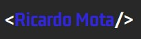

<h1 align="center">
    
</h1>

<h1>
    
</h1>

<h3 align="center">
    <a href="https://rickmotasantos.github.io/portifolio/">Acessar a demostração</a>
</h3>

# Índice
- [Sobre](#-sobre)
- [teconologias utilizadas](#-tecnologias-utilizadas)
- [como baixar](#-como-baixar-o-projeto)

# 🎴Sobre

O projeto meu **portifólio** foi desenvolvido para armazenar alguns dos meus projetos e demostrar um pouco dos meus conhecimentos de programação voltado para a área **Frontend**. 


# 🚀Tecnologias Utilizadas

O projeto foi desenvolvido utilizando as seguintes tecnologias

- Html 5
- Css 3
- JavaScript


# 📁Como baixar o projeto

```bash

    #clonar repositório
    $ git clone https://github.com/rickmotasantos/portifolio


    #entrar no diretório
    $ cd rickmotasantos

    #instalar dependências
    $ yarn install

    # iniciar o projeto
    $ yarn start
```

---

Desenvolvido por Ricardo Mota 😉